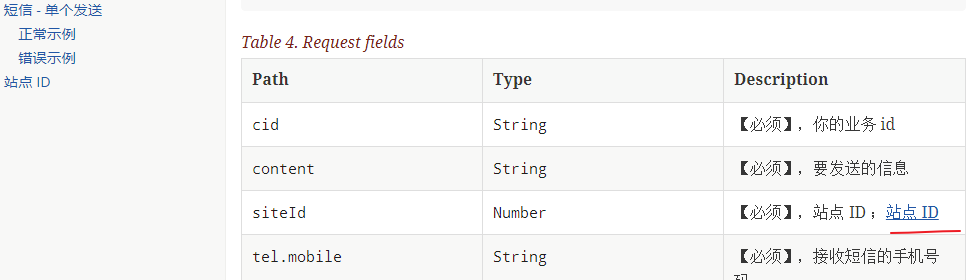

#  restdocs详细教程-进阶篇3


* 文件内引用
* gradle task 复制生成的的文件到指定目录


## 文件内引用
假设你的 doc 源文件是这样的。需要在 sms.adoc 中对一段文字添加锚点 -> 跳往 site.adoc 中的一个段落

```
asciidoc
  api.adoc
  xxx.adoc
  site.adoc
  sms.adoc
```



就可以这样写：
```java
.andDo(document("/api_sms_send_sussess",
 requestFields(
         fieldWithPath("cid").description("【必须】，你的业务 id "),
         fieldWithPath("content").description("【必须】，要发送的信息"),
         fieldWithPath("siteId").description("【必须】，站点 ID ；<<sms.adoc#_站点_id>>"),
```

> 详细语法可以参考这里 https://asciidoctor.org/docs/asciidoc-syntax-quick-reference/#links

其实在 api 中的 description 只要添加上 asciidoctor 的语法即可


## gradle task

**解决的问题**：默认生成的都是在 build （对于 gradle 来说）目录下，但是这个目录都是被忽略提交的。 那么我们要把生成片段代码 + 最终生成的 html 留档并上传到git，怎么办呢？

asciidoctor 转 thml 插件输出目录是可以定制的，JUnitRestDocumentation 的代码片段生成也是可以定制的。 api的可以通过下面的修改。 插件的去查看插件官网说明把
```java
@Rule
   public final JUnitRestDocumentation restDocumentation = new JUnitRestDocumentation("片段生成路径");
```

但是经过尝试，比较麻烦。要统一多个地方的输入和输出。

这里想了一个使用 gradle task 来复制成品文档的方法。

能实现的功能是：

1. 其他的输入输出路径不用修改
2. 在运行 gradle asciidoctor 任务的时候自动把生成的片段和最终的 html 复制到指定目录存档。

这样就能把这个指定目录添加到 git 了

```
// 设置备份，新克隆的项目，不用全部重新构建
asciidoctor.doLast {
    copy {
        from 'build/asciidoc/html5'
        into "$projectDir/docs/asciidoc/html5"
    }
    // 如果是新项目，把该目录反拷贝即可运行 asciidoctor 生成 html
    copy {
        from 'build/generated-snippets'
        into "$projectDir/docs/generated-snippets"
    }
}
```
